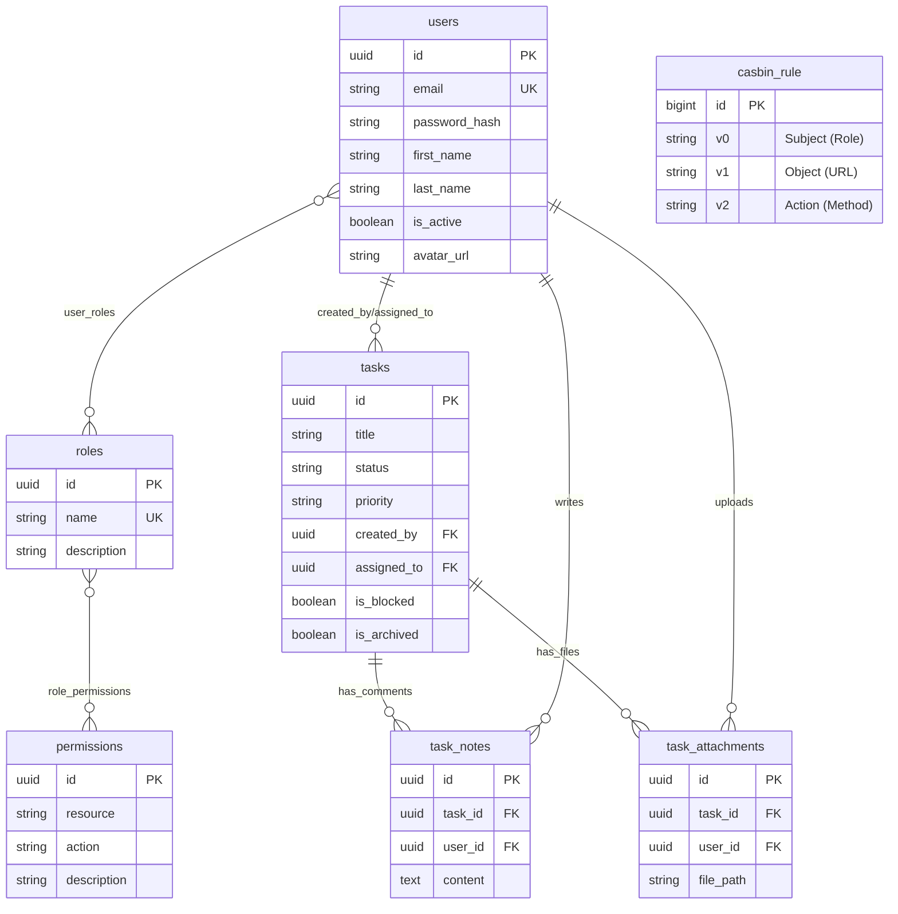

# Taskify — Task Management API

[](https://go.dev/)
[](https://www.postgresql.org/)
[](https://redis.io/)
[](https://www.docker.com/)

A production-grade Task Management API built with Go, featuring a clean architecture, robust security, and deep observability. The project also includes a Svelte 5 demo client to showcase the API's capabilities in a real-world scenario.

Taskify is primarily a backend-focused project showcasing advanced Go engineering patterns, secure authentication, and system observability:

- **Robust Go API** — RESTful interface built with Gin, following clean architecture principles for maintainability and testing.
- **Authentication & Dynamic RBAC** — Secure JWT authentication using RSA key pairs and Argon2id password hashing. Multi-role dynamic RBAC via [Casbin](https://casbin.org/) with PostgreSQL persistence, supporting granular permissions and role associations.
- **Observability** — End-to-end distributed tracing using OpenTelemetry (OTLP) with Jaeger, and structured JSON logging via the standard library `slog`.
- **Database Architecture** — High-performance schema using PostgreSQL 17 with GORM, managed by versioned SQL migrations using `golang-migrate`.
- **Docker-First Workflow** — Multi-stage builds for optimized production images and a unified Docker Compose setup for local development.
- **Task Management Engine** — Full task lifecycle management, including comments, attachments, priorities, and status transitions.
- **Frontend Demo (Bonus)** — A responsive Kanban board built with Svelte 5, TanStack Query, and Skeleton UI, demonstrating how to consume the API correctly.

## Tech Stack

| **Backend** | Go 1.24, Gin |
| **Database** | PostgreSQL 17, GORM |
| **Auth & Security** | JWT (RSA), Argon2id, Casbin (RBAC) |
| **Tracing** | OpenTelemetry + Jaeger |
| **Cache** | Redis 7 |
| **Documentation** | Swagger (swag) |
| **Containerization** | Docker, Docker Compose |
| **Frontend (Demo)** | Svelte 5, TanStack Query, Skeleton UI |

## Architecture

The project maintains a clear separation between the presentation layer and the core business logic:

```
┌─────────────────────────────────────────────────────┐
│             Bonus Frontend Demo (Svelte)            │
│   Reactive UI, TanStack Query, Skeleton Components   │
├─────────────────────────────────────────────────────┤
│                  Backend (Go API)                   │
│   Handlers, Services, Repositories, Domain Models,   │
│   Middleware (Auth, RBAC, Tracing, Rate Limiting)   │
├─────────────────────────────────────────────────────┤
│                 Infrastructure Layer                │
│   PostgreSQL, Redis, OpenTelemetry, S3-style Uploads │
└─────────────────────────────────────────────────────┘
```

## Project Structure

```
.
├── backend/                   # Go API Core (Go 1.24 + Gin)
│   ├── cmd/
│   │   ├── api/               # API entrypoint (server setup & shutdown)
│   │   └── seed/              # Database seeding logic
│   ├── internal/
│   │   ├── config/            # Environment configuration (caarlos0/env)
│   │   ├── handlers/          # HTTP Handlers (Restful logic)
│   │   ├── middleware/        # Gin Middlewares (Auth, RBAC, Tracing, CORS)
│   │   ├── models/            # Domain models and GORM entities
│   │   ├── pkg/               # Common utilities (JWT, Hashing, Tracing)
│   │   ├── repository/        # Data access layer (GORM implementations)
│   │   ├── routes/            # Router registration and wiring
│   │   └── service/           # Business logic and coordination
│   ├── migrations/            # Versioned SQL migrations (golang-migrate)
│   ├── model.conf             # Casbin RBAC model configuration
│   └── Dockerfile             # Multi-stage optimized production build
├── frontend/                  # Svelte 5 Demo Client (Bonus)
│   ├── src/                   # Reactive state, components, and routes
│   └── Dockerfile             # Nginx-based production deployment
├── deployment/                # Docker Compose orchestration
└── Makefile                   # Task automation (Migrations, Keys, Docker)
```

## Prerequisites

| Tool | Version | Purpose |
|---|---|---|
| [Go](https://go.dev/dl/) | 1.24+ | Build and run the backend API |
| [Node.js](https://nodejs.org/) | 20+ | Build and run the frontend application |
| [Docker](https://docs.docker.com/get-docker/) | 20.10+ | Orchestrate local infrastructure (Postgres, Redis, Jaeger) |
| [OpenSSL](https://www.openssl.org/) | any | Generate RSA key pairs for JWT signing |

## Environment Variables

The application loads settings from environment variables, with an optional `.env` file for local development.

### Backend (.env)

| Variable | Required | Default | Description |
|---|---|---|---|
| `DB_HOST` | ✅ | `localhost` | PostgreSQL host address |
| `DB_PORT` | ✅ | `5432` | PostgreSQL port |
| `DB_USER` | ✅ | — | PostgreSQL username |
| `DB_PASSWORD` | ✅ | — | PostgreSQL password |
| `DB_NAME` | ✅ | — | PostgreSQL database name |
| `APP_PORT` | ❌ | `8080` | Backend API listening port |
| `ENV` | ❌ | `development` | Environment (`development` or `production`) |
| `PRIVATE_KEY_PATH`| ❌ | `private.pem` | Path to RSA private key for JWT |
| `PUBLIC_KEY_PATH` | ❌ | `public.pem` | Path to RSA public key for JWT |
| `OTLP_ENDPOINT` | ❌ | `localhost:4317` | OpenTelemetry Collector endpoint |
| `REDIS_HOST` | ❌ | `localhost` | Redis server host |
| `RATE_LIMIT_GLOBAL`| ❌ | `100-M` | Global rate limit (requests-period) |
| `UPLOAD_PATH` | ❌ | `uploads` | Directory for task attachments |

### Frontend (.env)

| Variable | Required | Default | Description |
|---|---|---|---|
| `PUBLIC_API_URL` | ✅ | `http://localhost:8080` | Backend API base URL |

---

## Getting Started

### Option 1 — Easy Start with Docker Compose

The fastest way to get the full stack running (API + Frontend + Postgres + Redis + Jaeger):

```bash
# 1. Clone the repository
git clone https://github.com/jandiralceu/taskify.git
cd taskify

# 2. Generate RSA keys for JWT authentication
make generate-keys

# 3. Start all services (Infra + API + Frontend)
# This builds images and runs database migrations automatically
make docker-up-all

# 4. (Optional) Seed the database with sample data (CR7, Messi, etc)
make db-restore
```

Access the Frontend at `http://localhost:3000` and the API at `http://localhost:8080`.

### Demo Users

For testing purposes, you can use the following pre-configured accounts. All users share the same password: **`P4ss0Rdd`**.

| Role | Name | Email | Tasks? |
|---|---|---|---|
| **Admin** | Cristiano Ronaldo | `cr7@taskify.com` | ✅ Yes |
| **Admin** | Lionel Messi | `messi@taskify.com` | ✅ Yes |
| **Employee** | Neymar Junior | `ney@taskify.com` | ✅ Yes |
| **Employee** | Lamine Yamal | `lamine@taskify.com` | ✅ Yes |

> [!TIP]
> Use an **Admin** account to manage roles and other users, or an **Employee** account for standard task management.

### Option 2 — Local Development (Mixed)

Run the backend natively for debugging while keeping infrastructure in Docker:

```bash
# 1. Start infrastructure containers (DB, Redis, Jaeger)
# Current directory should be root
make docker-up

# 2. Setup Backend
cd backend
cp .env.example .env  # Update with your local settings
make generate-keys
make migration-up
go run cmd/api/main.go

# 3. Setup Frontend (In a new terminal)
cd frontend
cp .env.example .env  # Update PUBLIC_API_URL if necessary
npm install
npm run dev
```

## Available Makefile Commands

| Command | Location | Description |
|---|---|---|
| `make docker-up` | Root | Start PostgreSQL, Redis, and Jaeger containers |
| `make docker-up-all` | Root | Start all containers including the Go API and Svelte Demo |
| `make docker-down` | Root | Stop and remove all Docker containers |
| `make generate-keys` | Root | Generate RSA key pairs for JWT signing |
| `make test` | Root | Run all tests (Backend unit + Integration, Frontend unit) |
| `make start` | Backend | Run the Go application natively with `go run` |
| `make migration-up` | Backend | Apply all pending database migrations |
| `make migration-down`| Backend | Rollback the latest database migration |
| `make db-dump` | Root | Create a data-only backup to `deployment/seed.sql` |
| `make db-restore` | Root | Restore database data from `deployment/seed.sql` |
| `make swagger` | Backend | Regenerate Swagger API documentation |
| `make lint` | Root | Run code quality checks across the entire stack |

## API Documentation

Full interactive documentation is available via Swagger UI at `http://localhost:8080/swagger/index.html` when the server is running. The API follows REST conventions and is organized into logical resource groups:

| Group | Prefix | Auth | Description |
|---|---|---|---|
| **Authentication** | `/auth` | No | Registration, Login, Logout, and Token Refresh |
| **Roles** | `/roles` | Yes | Dynamic RBAC management and role assignments |
| **Users** | `/users` | Yes | User profiles and account management |
| **Tasks** | `/tasks` | Yes | Kanban lifecycle (CRUD, filtering, archiving) |
| **Notes** | `/notes` | Yes | Task comments and threaded discussions |
| **Attachments** | `/attachments` | Yes | File uploads and binary asset management |

---

## Database Architecture

The application uses a PostgreSQL database with a dynamic RBAC (Role-Based Access Control) system. The relationship between core entities is visualized below:



---

## Database Migrations

Database schema management is handled exclusively by `golang-migrate`. When running via Docker, migrations are applied automatically by a dedicated container before the API starts.

### Workflow

```bash
# 1. Create a new migration file
cd backend && make migration-create name=add_indices_to_tasks

# 2. Apply migrations manually
make migration-up

# 3. Rollback (if necessary)
make migration-down
```

### Data Seeding & Backup

You can backup the current state of your database (data only) or restore it using the following commands:

```bash
# Save current database data (users, tasks, etc) to deployment/seed.sql
make db-dump

# Restore data from deployment/seed.sql into the database
make db-restore
```

> **Note:** These commands use the `taskify-postgres` Docker container to perform the dump and restore.

---

## Testing

Taskify implements a dual-layer testing strategy to ensure reliability across both business logic and infrastructure integration.

### Unit Testing
Focused on isolated logic using Go's built-in testing package.
- **Handlers**: Tested for correct HTTP status codes and response binding.
- **Service**: Business logic and domain rules verification.
- **Middleware**: Validation of JWT, RBAC permissions, and Rate Limiting.

```bash
cd backend && make test-unit
```

### Integration Testing
Utilizes [testcontainers-go](https://golang.testcontainers.org/) to spin up ephemeral PostgreSQL and Redis instances, exercising the full data access layer.

```bash
cd backend && make test-integration
```

---

## Observability

The application is fully instrumented with **OpenTelemetry** for distributed tracing. Every request is tracked as it passes through middleware, business logic, and database queries.

- **Tracing Backend**: Traces are exported via OTLP to [Jaeger](https://www.jaegertracing.io/).
- **What is traced**: Incoming HTTP requests (Gin), SQL queries (GORM), and Cache operations (Redis).
- **Access the Dashboard**: Open [http://localhost:16686](http://localhost:16686) while the stack is running to explore trace timelines and latency breakdowns.

---

## License

This project is licensed under the MIT License.
